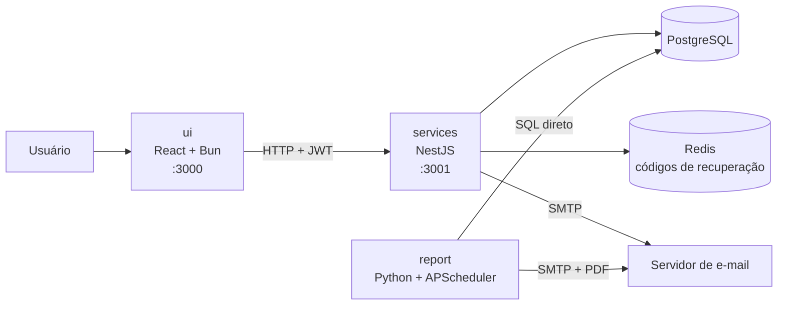

# Sharkin

Sistema para **registro e acompanhamento de plantões desenvolvido na Focus Consultoria Jr**. Os usuários registram a entrada e a saída de cada plantão por uma interface web, os dados ficam em um banco PostgreSQL e, toda sexta-feira às 18:20, um relatório semanal em PDF é enviado por e-mail.

---

## Sumário

1. [Visão geral](#1-visão-geral)
2. [Arquitetura](#2-arquitetura)
3. [Estrutura do repositório](#3-estrutura-do-repositório)
4. [Pré-requisitos](#4-pré-requisitos)
5. [Como rodar o projeto completo](#5-como-rodar-o-projeto-completo)
6. [Portas e variáveis de ambiente](#6-portas-e-variáveis-de-ambiente)
7. [Fluxos de ponta a ponta](#7-fluxos-de-ponta-a-ponta)

---

## 1. Visão geral

O projeto é dividido em três partes independentes:

| Parte      | Tecnologia                | Função                                                                  | Documentação                               |
| ---------- | ------------------------- | ----------------------------------------------------------------------- | ------------------------------------------ |
| `services` | NestJS, PostgreSQL, Redis | API: usuários, plantões, autenticação JWT e recuperação de senha.       | [services/README.md](./services/README.md) |
| `ui`       | React, Bun, Tailwind      | Interface web: login, cadastro, recuperação de senha e área do usuário. | [ui/README.md](./ui/README.md)             |
| `report`   | Python, WeasyPrint        | Gera o relatório semanal em PDF e o envia por e-mail.                   | [report/README.md](./report/README.md)     |

## 2. Arquitetura



Pontos importantes:

- A **UI** nunca acessa o banco: toda a comunicação passa pela API.
- O **report** não usa a API. Ele lê o PostgreSQL diretamente, então depende do esquema das tabelas `duties` e `users`. Mudanças nessas tabelas podem quebrá-lo.
- O **Redis** é usado só pelo `services`, para guardar os códigos de recuperação de senha (validade de 5 minutos).
- O envio de e-mail acontece em dois lugares: no `services` (código de recuperação) e no `report` (relatório semanal).

## 3. Estrutura do repositório

```
Sharkin/
├── services/        # API NestJS
│   ├── src/
│   ├── .env.example
│   └── README.md
├── ui/              # Interface React + Bun
│   ├── src/
│   ├── .env.example
│   └── README.md
├── report/          # Serviço Python do relatório semanal
│   ├── app.py
│   ├── .env.example
│   └── README.md
└── README.md        # Este arquivo
```

## 4. Pré-requisitos

| Ferramenta     | Usado por             |
| -------------- | --------------------- |
| Node.js ou Bun | `services`            |
| Bun            | `ui`                  |
| Python 3.12+   | `report`              |
| PostgreSQL     | `services` e `report` |
| Redis          | `services`            |

## 5. Como rodar o projeto completo

Todos os serviços sobem na mesma rede criada pelo Docker Compose. Dentro dela, cada container é acessado pelo nome do serviço definido no docker-compose.yml. Na mesma pasta que contém o arquivo compose.yaml (raiz do projeto) rode

```
docker compose up --build
```

Depois disso:

UI: http://localhost:3000
API: http://localhost:3001
O report fica em execução e envia o relatório toda sexta-feira às 18:20.

Para descer os containers:

```
docker compose down
```

Se estiver em um ambiente linux sem ter configurado o usuário, rode esses comando como `sudo`

## 6. Portas e variáveis de ambiente

| Parte      | Porta padrão | Arquivo de variáveis |
| ---------- | ------------ | -------------------- |
| `ui`       | `3000`       | `ui/.env`            |
| `services` | `3001`       | `services/.env`      |
| PostgreSQL | `5432`       |                      |
| Redis      | `6379`       |                      |

Cada parte tem seu `.env.example` com todas as variáveis. Atenção a dois pontos de configuração compartilhada:

- **`DATABASE_URL`** é usada por `services` e `report` e deve apontar para o **mesmo banco**.
- A **URL da API** (`http://localhost:3001`) está fixa em `ui/src/api/api.ts`. Se a porta de `SERVICES_PORT` mudar, a UI precisa ser ajustada.

Os arquivos `.env` **nunca** devem ser versionados. Confirme que estão no `.gitignore`

## 7. Fluxos de ponta a ponta

**Registro de plantão**

1. O usuário faz login na UI (`POST /auth/sign-in`) e recebe um JWT válido por 5 minutos.
2. Um plantão é criado para o usuário (aberto, com o horário de entrada definido pelo servidor).
3. Ao terminar, o usuário registra a saída (`PATCH /duty/:id`) e o plantão é fechado.

**Recuperação de senha**

1. O usuário pede o código na UI e a API o gera, guarda no Redis (5 minutos) e envia por e-mail.
2. O usuário informa o código, que a API valida e invalida em seguida.
3. O usuário define a nova senha.

**Relatório semanal**

1. Toda sexta-feira às 18:20 (`America/Sao_Paulo`), o `report` busca no banco os plantões de segunda-feira até o dia da execução.
2. Gera o PDF e o envia por e-mail ao destinatário configurado.
